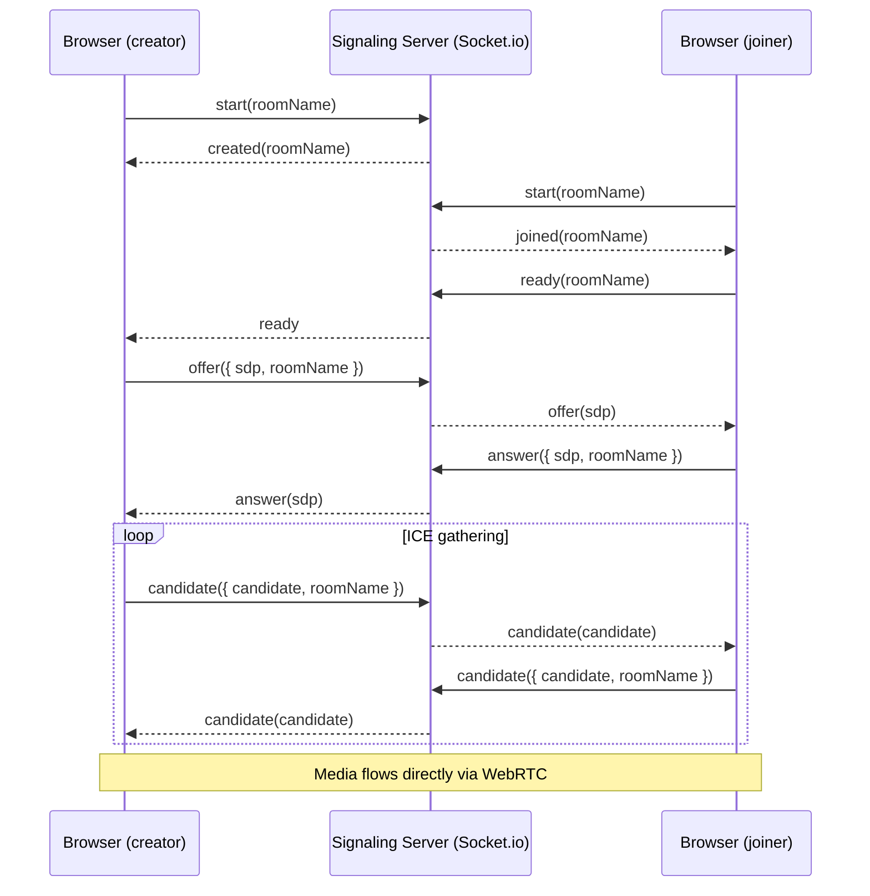

## WebRTC

```mermaid
sequenceDiagram
    participant U1 as Browser (creator)
    participant S  as Signaling Server (Socket.io)
    participant U2 as Browser (joiner)

    %% 1. Room creation
    U1->>S: start(roomName)
    S-->>U1: created(roomName)

    %% 2. Joiner enters
    U2->>S: start(roomName)
    S-->>U2: joined(roomName)
    U2->>S: ready(roomName)

    %% 3. Creator sends offer
    S-->>U1: ready
    U1->>S: offer({ sdp, roomName })

    %% 4. Joiner sends answer
    S-->>U2: offer(sdp)
    U2->>S: answer({ sdp, roomName })

    %% 5. Creator receives answer
    S-->>U1: answer(sdp)

    %% 6. ICE candidates
    loop ICE gathering
      U1->>S: candidate({ candidate, roomName })
      S-->>U2: candidate(candidate)
      U2->>S: candidate({ candidate, roomName })
      S-->>U1: candidate(candidate)
    end

    %% 7. P2P media
    Note over U1,U2: Media flows directly via WebRTC
```
